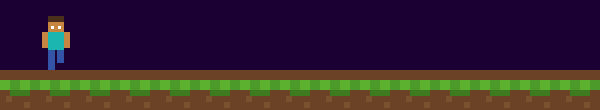

<table width="100%">
<tr>
<td width="28%" align="center">

</td>
<td width="72%">

# Hi, I'm Azka

</td>
</tr>
</table>

## About Me

Saya **Azka Labib Abdillah Zain**, fullstack developer dan solo builder dari Lumajang. Saya membangun produk web & mobile dari nol — mulai dari riset kebutuhan, desain, sampai eksekusi kode — tanpa tim, sepenuhnya independen. Fokus saya saat ini adalah menghadirkan platform digital yang relevan untuk pasar Indonesia.

## Currently Building

<table width="100%">
<tr>
<td width="50%" valign="top">

### AZKA TOP UP
Platform top up game online untuk pasar Indonesia.

- Pembayaran otomatis via Midtrans Payment Gateway
- Integrasi katalog & stok game real-time via Digiflazz
- Sistem notifikasi transaksi otomatis lewat email

</td>
<td width="50%" valign="top">

### FlowTask / Vorxa
Aplikasi produktivitas berbasis Android.

- Kanban board (To Do, In Progress, Done)
- Login aman via Google OAuth & Supabase Auth
- Local caching dengan Room Database
- Background sync otomatis via WorkManager

</td>
</tr>
</table>

## Currently Learning

## Tech Stack

## Tools

*"Kode yang baik lahir dari rasa ingin tahu yang nggak pernah berhenti."*

## GitHub Stats

## Contribution Snake

## Let's Connect

