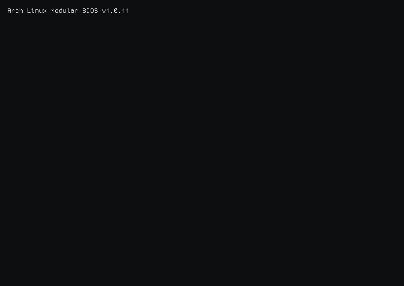

  <picture>
    <source media="(prefers-color-scheme: dark)" srcset="./output.gif">
    <source media="(prefers-color-scheme: light)" srcset="./output.gif">
    
  </picture>

    

  

    
    
  

